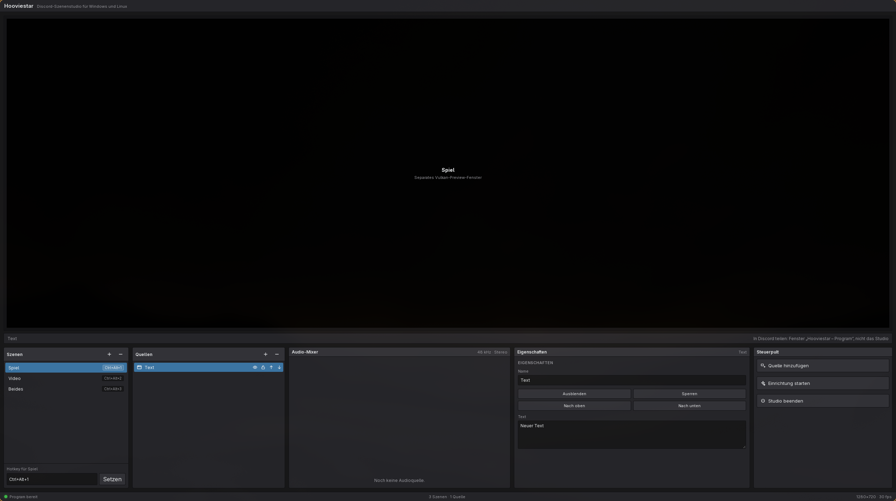
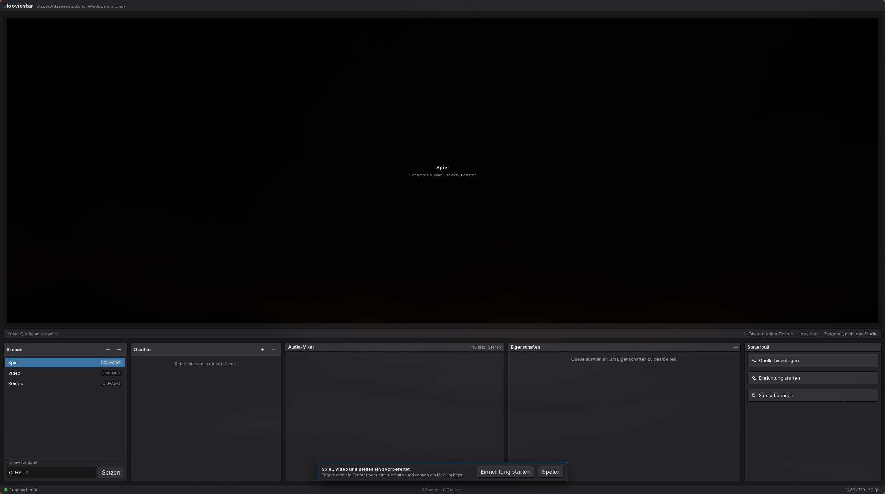
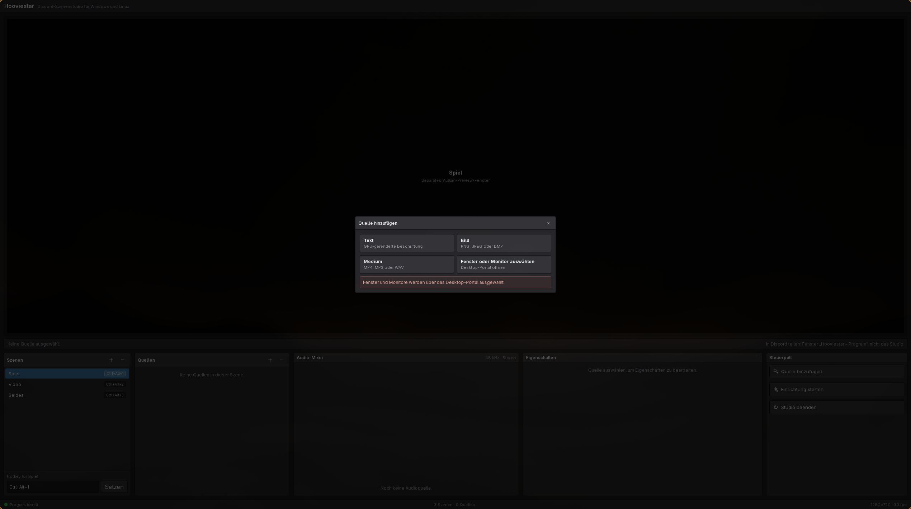

# Hooviestar

Native GPU scene compositing for a clean Discord screen-share window on Windows and Linux.

[](https://github.com/openhoo/hooviestar/actions/workflows/ci.yml)

Hooviestar keeps scene setup, source controls, audio mixing, and preview tooling in one visible studio window. In Discord, select the virtual **Hooviestar – Program** app: it stays mapped for capture but outside the physical desktop, so controls and setup dialogs never become part of the shared output.

> **Status:** Hooviestar is at version 0.1.1 and under active development. Build it from source and expect the project format and platform integration to evolve.



## Highlights

- Native render paths: D3D11 on Windows and Vulkan 1.2 on Linux.
- Window and display capture through Windows Graphics Capture or the Linux desktop portal and PipeWire.
- Window, display, text, image, local media, and application-audio sources.
- Scene ordering, visibility, locking, renaming, and global scene hotkeys.
- Per-source volume, mute controls, live meters, and media playback controls.
- One visible Studio plus capture-only Program and native Preview surfaces.
- Atomic, debounced project persistence with corrupt-file recovery.
- Shared JSON command, event, and project contracts across TypeScript and Rust.

## Screenshots

<p>
  
  
</p>

The screenshots show the Linux Tauri application. On Hyprland, Hooviestar uses XWayland for stable ownership of its Vulkan surfaces and keeps them in a hidden special workspace; classic X11 places them offscreen. Windows embeds the D3D11 preview in the Studio surface.

## Platform paths

| Area | Windows | Linux |
| --- | --- | --- |
| Composition | D3D11 | Vulkan 1.2 |
| Window capture | Windows Graphics Capture | xdg-desktop-portal and PipeWire |
| Display capture | DXGI output capture | xdg-desktop-portal and PipeWire |
| Application audio | WASAPI process loopback | PipeWire nodes |
| Images and media | WIC and Media Foundation | Image decoders and GStreamer |
| Preview | Embedded native child surface | Hidden native Vulkan surface |
| Bundle | NSIS installer | AppImage and Debian package |

## Requirements

- Node.js 24.x. The repository declares `>=24 <25`.
- Rust with Cargo, `rustfmt`, and Clippy. The workspace MSRV is Rust 1.96.
- The [Tauri 2 system prerequisites](https://v2.tauri.app/start/prerequisites/) for the host platform.

### Linux

Linux additionally needs:

- A Vulkan 1.2-capable GPU and matching Vulkan driver.
- PipeWire and a desktop-specific xdg-desktop-portal implementation.
- GStreamer with the base, good, and bad plugin sets.
- WebKitGTK 4.1 and the native development headers used by Tauri.

Ubuntu 24.04 and related distributions can install the build and runtime dependencies with:

```sh
sudo apt update
sudo apt install \
  build-essential curl wget file libssl-dev libxdo-dev \
  libwebkit2gtk-4.1-dev libayatana-appindicator3-dev librsvg2-dev patchelf \
  libpipewire-0.3-dev libvulkan-dev libclang-dev \
  libgstreamer1.0-dev libgstreamer-plugins-base1.0-dev \
  gstreamer1.0-plugins-base gstreamer1.0-plugins-good gstreamer1.0-plugins-bad
```

On Arch Linux, install the equivalent packages:

```sh
sudo pacman -S --needed \
  base-devel webkit2gtk-4.1 librsvg patchelf clang \
  pipewire libpipewire vulkan-headers vulkan-icd-loader \
  gstreamer gst-plugins-base gst-plugins-good gst-plugins-bad
```

Install the Vulkan driver and portal implementation appropriate for the desktop separately, such as `vulkan-radeon` plus `xdg-desktop-portal-hyprland`.

### Windows

Install Microsoft C++ Build Tools with the **Desktop development with C++** workload and the Microsoft Edge WebView2 Runtime. Use the `x86_64-pc-windows-msvc` Rust target for the supported Windows build.

## Run locally

```sh
git clone https://github.com/openhoo/hooviestar.git
cd hooviestar
npm ci
npm run tauri dev
```

The app creates three surfaces, but only the Studio is visible on the physical desktop:

1. **Hooviestar** is the Studio control surface.
2. **Hooviestar – Program** is the capture-only output to select under Discord's **Applications** tab.
3. **Hooviestar – Preview** is an internal native Linux render target. Windows renders the preview inside Studio.

Do not minimize or reveal the Program surface. Hooviestar keeps it mapped and rendered automatically: in a hidden Hyprland special workspace on Wayland, outside the virtual desktop on X11 and Windows. This is necessary because a genuinely hidden/unmapped window is not available in Discord's application picker.

On first start, Hooviestar creates three scenes:

- **Spiel** (`Ctrl+Alt+1`) receives game/window capture.
- **Video** (`Ctrl+Alt+2`) receives local video.
- **Beides** (`Ctrl+Alt+3`) combines game capture with a picture-in-picture video.

The default hotkeys also identify these roles when Hooviestar places newly added sources automatically. Scene names may change; keep the three default hotkeys assigned if automatic placement is required.

## Build installers

Install frontend dependencies first with `npm ci`, then build on the target operating system.

Linux:

```sh
NO_STRIP=1 GSTREAMER_INCLUDE_BAD_PLUGINS=1 \
  npm run tauri build -- --bundles appimage,deb \
  --target x86_64-unknown-linux-gnu \
  --config src-tauri/tauri.local-build.conf.json
```

Windows:

```powershell
npm run tauri build -- --bundles nsis --target x86_64-pc-windows-msvc --no-sign --config src-tauri/tauri.local-build.conf.json
```

The local override disables updater artifacts, so ordinary developers do not need the protected release signing key. `NO_STRIP=1` avoids the older `linuxdeploy` strip tool failing on modern `DT_RELR` libraries; `GSTREAMER_INCLUDE_BAD_PLUGINS=1` includes the runtime plugins Hooviestar uses. Windows also uses `--no-sign`; only the tag workflow produces publisher-signed release installers. Bundles are written below `target/<target>/release/bundle/`.

## Test and qualify

```sh
npm test
npm run build
npm run release:test
cargo fmt --all --check
cargo clippy --workspace --all-targets -- -D warnings
cargo test --workspace
```

CI runs the frontend checks, Rust tests on Windows and Linux, the Rust 1.96 MSRV check, and release-configuration validation. Installer builds run only for version tags.

Windows also has an interactive, measured Discord qualification for real scene switching, offscreen Program capture, browser `<video>` motion, application sound, per-source mute/volume, mixing, limiter behavior, and receiver-side Discord transport. See [Windows and Discord qualification](docs/windows-discord-qualification.md). Run its native layer with:

```powershell
pwsh -File .\scripts\windows-discord\Start-Publisher.ps1 -NativeOnly
```

Full qualification requires publisher and receiver JSON reports; ordinary hosted CI cannot replace the interactive Discord/GPU/audio run.

## Releases and updates

Version tags produce a Windows NSIS installer, Linux AppImage, and Debian package. The release stays a draft until Windows Authenticode, Tauri updater signatures, an SPDX 2.3 SBOM, SHA-256 checksums, Sigstore signing, GitHub provenance/SBOM attestations, and the cross-platform `latest.json` manifest pass verification. Packaged NSIS, AppImage, and Debian builds then install their matching signed updates automatically on startup.

See [Releasing Hooviestar](docs/releasing.md) for signing-secret setup, version preparation, publication, updater behavior, and independent verification.

## Project data

Hooviestar saves the current project automatically:

- Linux: `${XDG_CONFIG_HOME:-$HOME/.config}/hooviestar/project.json`
- Windows: `%APPDATA%\Hooviestar\project.json`

Writes are atomic and debounced. If the project file is invalid or corrupt, Hooviestar moves it aside and starts with a fresh project.

## Repository layout

```text
src/                         React studio UI and validated IPC contracts
src-tauri/                   Tauri shell, native windows, hotkeys, and IPC
crates/hooviestar-engine/    Scene state, persistence, capture, audio, and rendering
contracts/                   Shared JSON contract fixtures
.github/workflows/ci.yml     Frontend, Rust, MSRV, and bundle qualification
```

## Current boundaries

- Windows and Linux are implemented; macOS is not currently supported.
- Project output accepts the 1280×720 at 30 fps and 1920×1080 at 60 fps presets.
- The Studio interface is currently German.
- Linux screen and window access is session-scoped and must be approved through the desktop portal.
- Invisible Wayland output currently requires Hyprland. X11 and Windows use an offscreen mapped window.

The Rust workspace declares the project under the MIT license.
